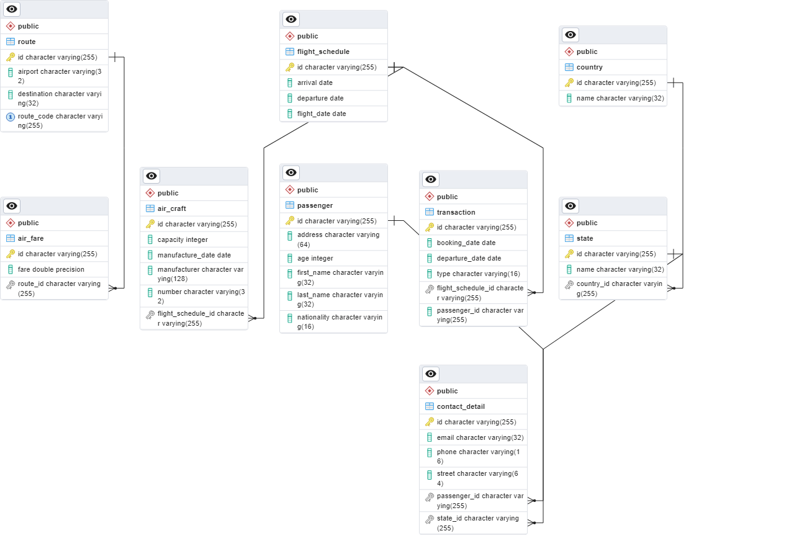

# Airlines Booking System

## Introduction

This is a simple Airlines Booking System.

## Entity Diagram

## Getting Started

### Prerequisites

* Java 17
* Maven 
* Docker
* Postgres

### Installing

* Clone the repository
* Open the project in your favorite IDE
* Run `mvn clean install` to build the project
* Create a database named `AirlinesBookingSystem` in Postgres

